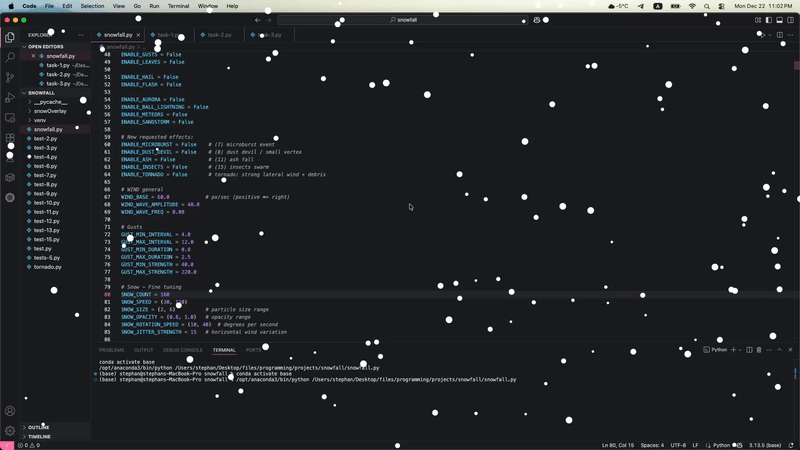

# snow-fall (macOS only)
> Application with which you can create your own custom weather that will be displayed on your screen.

---

## How to start?

1. Clone repository
```terminal
git clone https://github.com/shrechochek/snow-fall/
```

2. Install libraries
```terminal
pip install pyobjc
```

3. Set up your weather in `CONFIG` and run app

---

## Weather examples



